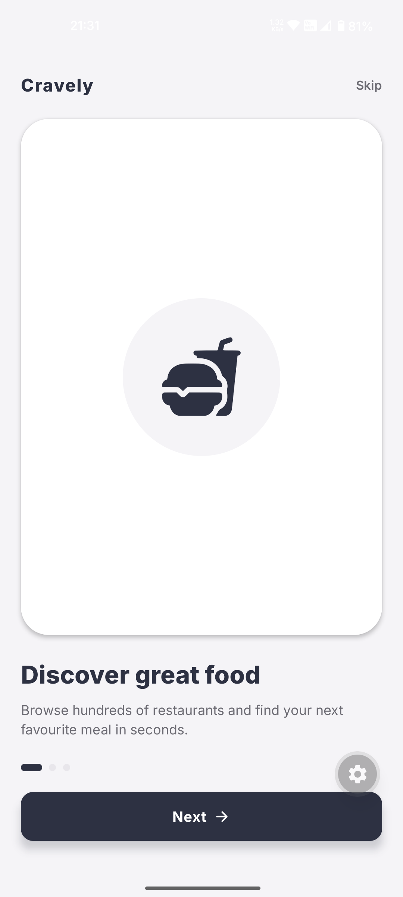
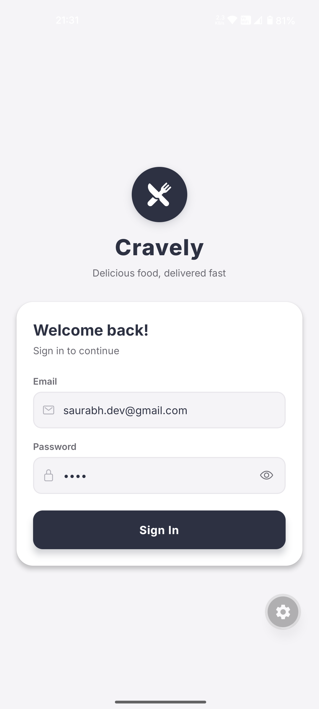
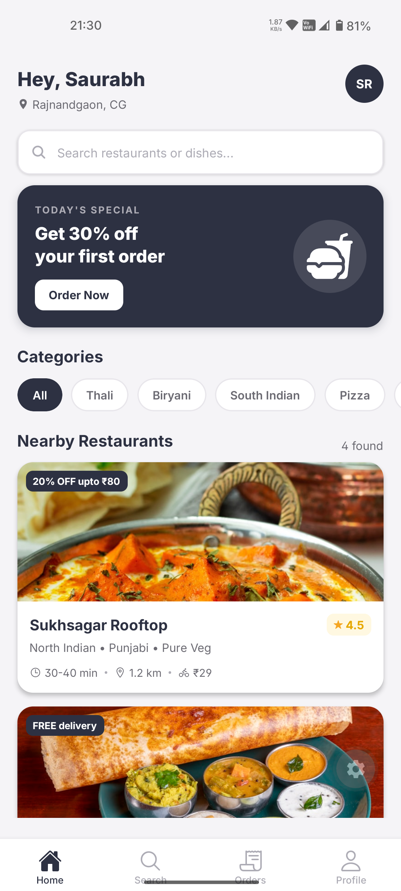
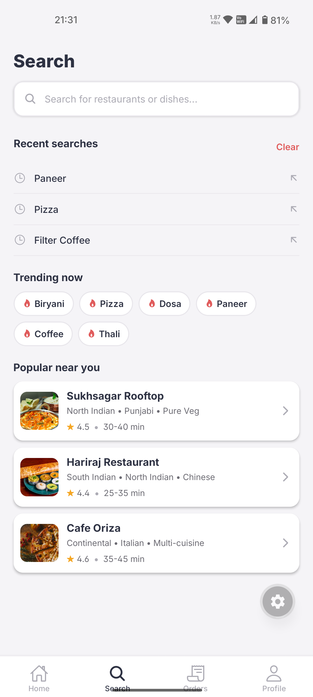
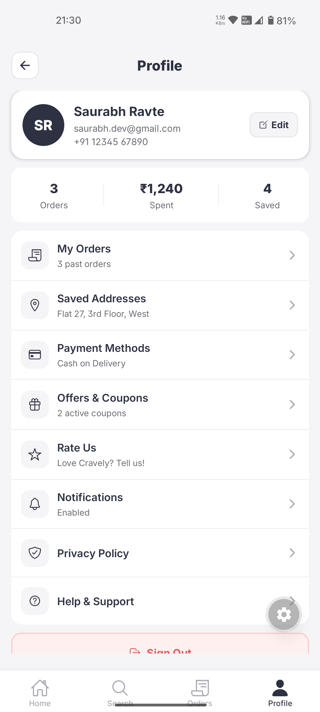

# Food Delivery App UI

A mobile UI assignment built with **React Native** and **Expo**, showcasing a clean and modern food delivery application interface. This project focuses purely on the UI layer — no backend, no API calls.

---

## Video Demo

> **Video Link :** [Click Here](https://youtube.com/shorts/m7ZKsqN49Ss?feature=share).

---

## Project Overview

> **Note:** This is a UI-only assignment. There is no real authentication, payment processing, or live data. All content is static/mocked.

---

## Tech Stack

| Technology                      | Version  | Purpose                            |
| ------------------------------- | -------- | ---------------------------------- |
| React Native                    | 0.83.6   | Core mobile framework              |
| Expo                            | ~55.0.24 | Build tooling & dev server         |
| TypeScript                      | ~5.9.2   | Type safety                        |
| React                           | 19.2.0   | UI library                         |
| React Navigation (Native Stack) | ^7.15.1  | Screen navigation                  |
| @expo/vector-icons              | ^15.0.2  | Icon library                       |
| react-native-screens            | ~4.23.0  | Native screen containers           |
| react-native-safe-area-context  | ~5.6.2   | Safe area insets                   |
| Bun                             | latest   | Package manager (lockfile present) |

---

## How to Run Locally

### Prerequisites

Make sure you have the following installed:

- [Node.js](https://nodejs.org/) (v18+ recommended)
- [Bun](https://bun.sh/) (preferred, since `bun.lock` is present) **or** npm/yarn
- [Expo CLI](https://docs.expo.dev/get-started/installation/)
- [Expo Go](https://expo.dev/client) app on your iOS or Android device, **or** an emulator/simulator (v55.0.7)

### Steps

```bash
# 1. Clone the repository
git clone https://github.com/SaurabhRavte/Food-Delivery-App-UI.git
cd Food-Delivery-App-UI

# 2. Install dependencies (using Bun — recommended)
bun install

# 3. Start the Expo development server
bunx expo start
```

### Run on a specific platform

```bash
# Android
bun run android
# OR
npx expo start --android

# iOS
bun run ios
# OR
npx expo start --ios

# Web (browser preview)
bun run web
# OR
npx expo start --web
```

Then scan the QR code in your terminal using the **Expo Go** app, or press `a` for Android emulator / `i` for iOS simulator.

---

## 🗺 Navigation Structure

The app uses **React Navigation Native Stack** with a single root navigator defined in `src/navigation/RootNavigator.tsx`.

```
App.tsx
└── NavigationContainer
    └── RootNavigator (Native Stack)
        ├── Splash / Onboarding Screen
        ├── Home Screen          (restaurant/food feed)
        ├── Restaurant Detail    (menu listing)
        ├── Item Detail          (food item view)
        ├── Cart Screen          (order summary)
        └── Checkout Screen      (order placement)
```

> The exact screen names can be found in `src/navigation/RootNavigator.tsx`. Update this diagram if you add or rename screens.

---

## Deep Linking Setup

Deep linking is **not explicitly configured** in this project as it is a UI-only assignment. However, Expo provides built-in support that can be enabled easily.

### To enable deep linking:

**1. Update `app.json`** — add a scheme:

```json
{
  "expo": {
    "scheme": "foodapp"
  }
}
```

**2. Update `NavigationContainer`** in `App.tsx`:

```tsx
import { Linking } from "react-native";

const linking = {
  prefixes: ["foodapp://", "https://yourdomain.com"],
  config: {
    screens: {
      Home: "home",
      RestaurantDetail: "restaurant/:id",
      Cart: "cart",
      Checkout: "checkout",
    },
  },
};

export default function App() {
  return (
    <NavigationContainer linking={linking}>
      <RootNavigator />
    </NavigationContainer>
  );
}
```

**3. Test a deep link:**

```bash
# Android
npx uri-scheme open foodapp://restaurant/1 --android

# iOS
npx uri-scheme open foodapp://restaurant/1 --ios
```

For full documentation, refer to the [Expo Linking docs](https://docs.expo.dev/versions/v55.0.0/sdk/linking/) and [React Navigation deep linking guide](https://reactnavigation.org/docs/deep-linking/).

---

## Screenshots







---

## Project Structure

```
Food-Delivery-App-UI/
├── assets/                  # Icons, images, splash screen
├── src/
│   └── navigation/
│       └── RootNavigator.tsx  # Main navigation stack
├── App.tsx                  # App entry — wraps NavigationContainer
├── index.ts                 # Expo entry point
├── app.json                 # Expo configuration
├── package.json             # Dependencies & scripts
├── tsconfig.json            # TypeScript config
└── bun.lock                 # Bun lockfile
```

---
